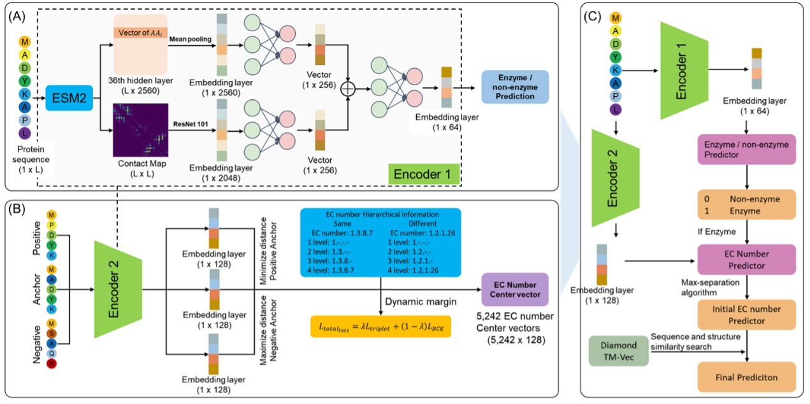

# EnzymeHunter

## Overview

**EnzymeHunter**: Achieving fine-grained enzyme function prediction with a hierarchically-aware contrastive learning framework.
This source code was developed and tested on **Linux (CentOS)** with **Python 3.9**.

## EnzymeHunter Architecture

Architecture and workflow of the EnzymeHunter model：



## Installation & Setup

1. **Clone the repository**

   ```bash
   git clone https://github.com/cgxbio/EnzymeHunter.git
   cd EnzymeHunter
   ```
2. **Create and activate the virtual environment**

   ```bash
   conda env create -f environment.yml
   conda activate EnzymeHunter
   ```

## Usage Example

Here are two common examples of using the  **EnzymeHunter** , corresponding to different running modes:

### 1. Normal Mode (Default Mode)

Use this mode when you need the program to automatically distinguish between enzymes and non-enzymes, and only predict EC numbers for proteins classified as enzymes:

```bash
# Example: run prediction on a dataset where not all proteins are enzymes
python EnzymeHunter.py --dataset example_test --all_are_enzymes False
```

Explanation:
--example_test is your test dataset name (without the .fasta extension)
--The program will first perform enzyme/non-enzyme classification prediction
--Only proteins predicted as enzymes (pred_label=1) will undergo subsequent EC number prediction
--Non-enzyme proteins will be marked with EC number 0.0.0.0

2. All-Enzymes Mode
   Use this mode when you know all proteins in the dataset are enzymes and want to skip the enzyme/non-enzyme classification step, proceeding directly to EC number prediction:

   ```bash
   # Example: run prediction assuming all proteins are enzymes
   python EnzymeHunter.py --dataset example_test --all_are_enzymes True

   ```

Explanation:
--example_test is your enzyme dataset name (without the .fasta extension)
--The --all_are_enzymes flag forces the program to treat all proteins as enzymes
--Skips the enzyme/non-enzyme classification step and proceeds directly to EC number prediction
--All proteins will have pred_label set to 1 and pred_prob set to 1.0
